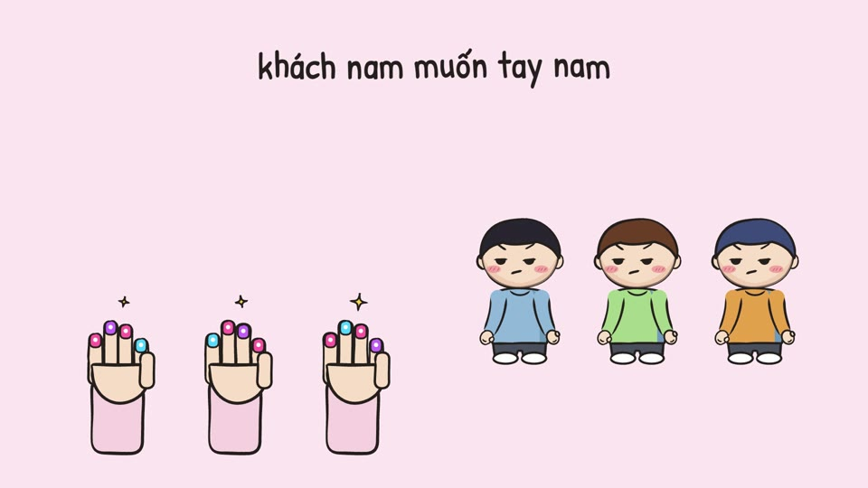
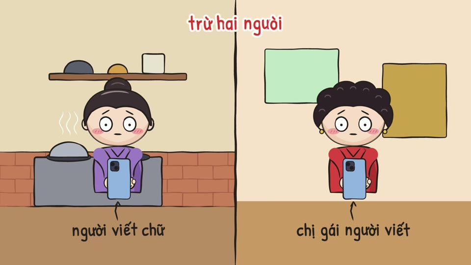
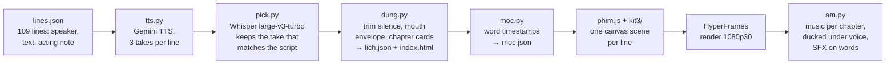

# Bàn tay mười nghìn · *The ten-thousand-đồng hand*

**An 11:47 hand-drawn animated short film, made entirely in code.** Original story, 109 lines in 11 chapters, 5 character voices, about 20 hand-drawn sets, 1080p30. No drawing app, no editing timeline: every frame is redrawn by a canvas ink rig and rendered with [HyperFrames](https://github.com/heygen-com/hyperframes).

*Phim hoạt hình vẽ tay 11 phút 47 giây, dựng hoàn toàn bằng code.*

### ▶ [Watch the full film (1080p, 11:47, Vietnamese)](https://github.com/ThinhHoang1/ban-tay-muoi-nghin/releases/download/v1.0/ban-tay-muoi-nghin.mp4) · [release page](https://github.com/ThinhHoang1/ban-tay-muoi-nghin/releases/tag/v1.0)

<p align="center"></p>

|  |  |  |  |
|:--:|:--:|:--:|:--:|

## The story (no spoilers)

Hiếu earns 8 million đồng a month and pays 5 million for a room in Hanoi, which leaves 100,000 a day. He makes extra money selling photos of omakase he never gets to eat: 10,000 đồng a shot, taken with the hand that wears the ring his mother gave him, for people who want to post a dinner they never had. His best customer buys at 23:40 every Saturday and never haggles. Then one Sunday at noon, his mother video-calls: *"Whose hand is this?"*

| | Chapter | | Chapter |
|---|---|---|---|
| 00:00 | Omakase mười nghìn | 06:09 | Tay ai đây |
| 00:33 | Một trăm nghìn một ngày | 07:19 | Linh Lang, nửa đêm |
| 01:56 | Anh Tuấn | 09:06 | Bài nói thật |
| 02:57 | Hai luật của nghề | 10:12 | Ruốc. Ăn dần. |
| 04:14 | Khách đêm | 10:53 | Giỗ ông ngoại |
| 05:22 | Ảnh cho mẹ | | |

Characters and events are fictional. Salary figures come from Vietnam's General Statistics Office and press reports, 2024–2026.

## How it is made



- **Voices that read Vietnamese right.** Reading a whole script in one TTS call drops or misreads lines. `tts.py` records every line 3 times with a per-character voice and style prompt plus an acting note for that line. `pick.py` transcribes every take with Whisper and keeps the one closest to the script.
- **Acting keyed to words, not seconds.** `moc.py` gets word-level timestamps from the final voices. Scenes call `m(c, i)`, the second at which word *i* of the line is spoken, so a hand reaches, a phone buzzes or a caption pops exactly on the word. `moc-doc.md` documents the convention.
- **A hand-drawn look without drawing.** `kit3/but.js` draws brush strokes with pressure, a slight hand tremor and "line boil" at 8 drawings per second, flat fills and handwritten text. `kit3/nv.js` is a chibi character rig with swappable expressions, `kit3/do.js` holds props and sets, and `kit3/chung.js` holds shared screens (calls, chats, Threads, bank statements).
- **One scene per line.** `kit3/canh.js` and `kit3/c-a.js` … `c-e.js` export `CANH = { lineNumber: (ctx, t, u, c) => … }`. If a file fails to load, only its scenes fall back to a placeholder, and the rest of the film still renders.
- **A twist the visuals can't spoil.** Chapter 5 never shows the night customer's face: only an avatar, payment notifications and chat bubbles. That rule is written into the scene file header.

## Repo layout

| Path | Contents |
|---|---|
| `lines.json` | Script: voices (Gemini voice + style prompt per character), chapters, 109 lines |
| `tts.py`, `pick.py` | Voice recording and take selection |
| `dung.py`, `moc.py` | Timing: schedule (`lich.json`), mouth envelopes, word timestamps (`moc.json`) |
| `phim.js`, `kit3/` | Renderer and every scene, character, prop and set |
| `index.html` | HyperFrames composition: canvas + audio tracks |
| `am.py` | Music bed and sound effects mixed onto the render |
| `chon-9*.json` | Take choices; `chon-9-cu.json` is the one `dung.py` reads for the released film |
| `docs/` | GIF, stills and thumbnails |

## Running it

Requirements: Node.js 22, Python 3.11 with numpy, ffmpeg, and `mlx-whisper` on Apple Silicon (for `pick.py` and `moc.py`).

```bash
# voices: any OpenAI-compatible gateway that serves Gemini TTS (e.g. a LiteLLM proxy)
export LITELLM_BASE=https://your-gateway.example.com LITELLM_KEY=sk-...
python3 tts.py 3                    # 3 takes per line → giong/
python3 pick.py lines-flat.json giong chon-9-cu.json   # dung.py reads this file
python3 dung.py                     # → lich.json, index.html, assets/voice/
python3 moc.py .                    # → moc.json
npm run dev                         # live preview in the browser
npm run render                      # → renders/*.mp4 (about 20 min on an Apple M4)
BGM_DIR=path/to/music python3 am.py renders/in.mp4 renders/out.mp4
```

Voices, music and renders are not in git (size and licensing). The released film is attached to the [v1.0 release](https://github.com/ThinhHoang1/ban-tay-muoi-nghin/releases/tag/v1.0).

## Credits

- Story, script, characters and code: ThinhHoang.
- Music: "Feather Waltz", "Dreams Become Real", "Bittersweet", "Touching Moments Two - Higher", "Healing", "Gymnopedie No 1" by Kevin MacLeod ([incompetech.com](https://incompetech.com)), licensed under [CC BY 4.0](https://creativecommons.org/licenses/by/4.0/).
- Fonts: Google Fonts (SIL Open Font License 1.1).
- Rendering: [HyperFrames](https://github.com/heygen-com/hyperframes) 0.8.136.

License: code is MIT; the story, script, characters and film are © ThinhHoang, all rights reserved. See [LICENSE](LICENSE).
